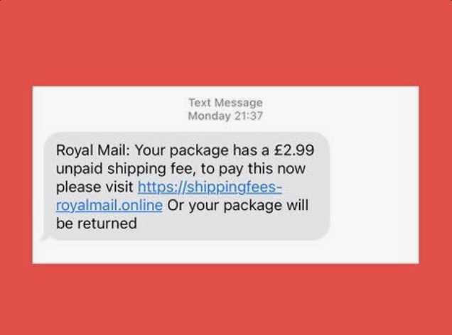
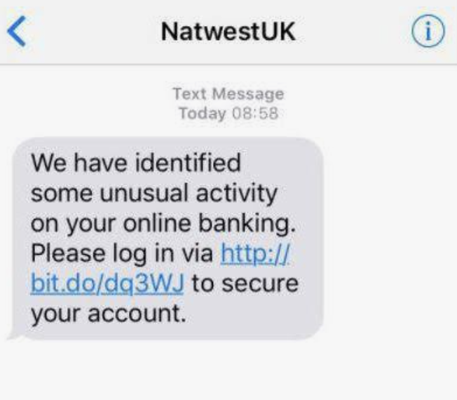
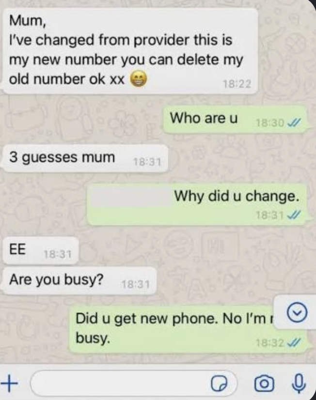

# Would You Fall for It?

Scams are designed to look believable.

They may arrive by:

- text message
- email
- WhatsApp or Messenger
- social media
- phone call
- online advert
- QR code

The important question is not:

> **"Would I definitely spot a scam?"**

It is:

> **"What can I check before I act?"**

---

# Opening Challenge

Look at each example and decide:

> **Genuine or scam?**

## Parcel delivery

Things to think about:

- Were you expecting a parcel?
- Why is the payment so small?
- What information might the website ask for?
- Could you check through Royal Mail's real website instead?

## Bank warning

Things to think about:

- Is the message creating panic?
- Are you being pushed to act immediately?
- How could you find the bank's real website?

## Family WhatsApp

Things to think about:

- Does this rely on trust and emotion?
- Could you contact the person on their normal number?
- Could you ask another family member?

---

# Remember

A scam does not have to look badly written.

Modern scams can look polished and professional.

> **What makes a message convincing is exactly what makes it dangerous.**
