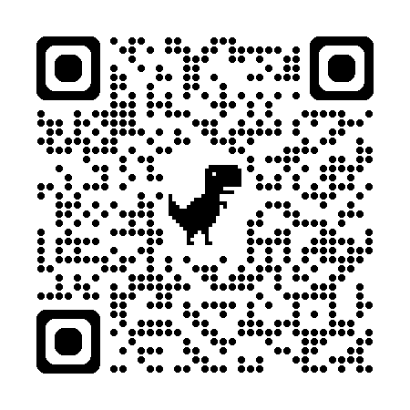

# Intro

# Welcome to Our Digital Skills Sessions

---

## About this project

These free monthly drop-in sessions run for around **90 minutes after the Coffee Morning** and cover practical topics such as:

- Internet basics  
- Staying safe online  
- Email and video calling  
- Online shopping and everyday digital tasks  
- Using smartphones, tablets, and computers  
- Understanding artificial intelligence in simple, useful ways  

Each session includes clear explanations, practical examples, and time for questions.

---

## About me

Hello, I’m **Kat Kmiotek**, and I’m running these sessions to help make technology feel more accessible and less intimidating.

I believe digital skills should be available to everyone, and that learning works best in a welcoming space where people can ask questions freely, try things out, and get patient support. I am a career changer just 6 years ago learned that tech is not that scary. When I was living in Glasgow I was running programming workshops.

My goal is to create sessions that are useful, practical, and enjoyable — helping people gain confidence with everyday technology in a way that feels manageable and relevant.

---

## Please ask questions

Questions are always encouraged.

You do not need to know anything before coming along, and you do not need to worry about getting things wrong. These sessions are for learning together, exploring new things, and building confidence step by step.

If something is unclear or unfamiliar, please ask. Chances are someone else is wondering the same thing too.

---

## A welcoming space

These sessions are designed to be:

- Friendly and informal  
- Practical and easy to follow  
- Suitable for beginners  
- Supportive and judgement-free  

Come along, have a listen, ask questions, and learn something new.
The presentation is in website format so you can access it after class as well.

## Link

[https://tech-3vh.netlify.app](https://tech-3vh.netlify.app)

QR Code  

---

## Support

This project is kindly supported by **Loch Long Jetty Association**.
